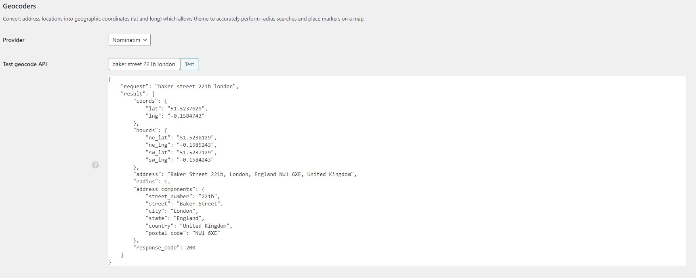
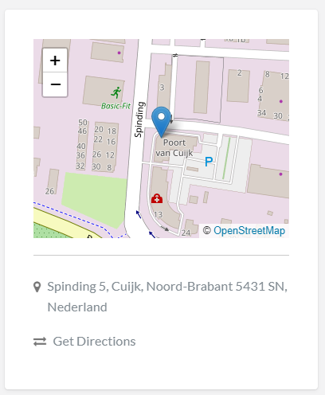

# vantage-osm

OpenStreetMap & Nominatim integration for Vantage WordPress theme (https://nl.wordpress.org/themes/vantage/)

| Geocoder | Map    |
|----------|--------|
| |  |

## Installation:

### Add files:
	- /wp-content/themes/appthemes-vantage/includes/geo/geocoders/nominatim-geocoder.php
	- /wp-content/themes/appthemes-vantage/includes/geo/map-providers/openstreetmap.php
	- /wp-content/themes/appthemes-vantage/includes/geo/map-providers/openstreetmap.js
	- /wp-content/themes/appthemes-vantage/includes/maps/class-openstreetmap.php
		
### Edit files:
	- /wp-content/themes/appthemes-vantage/includes/geo/load.php
		- Find: require_once (dirname(__FILE__) . '/map-providers/google-maps.php');
		- On next line, add: require_once (dirname(__FILE__) . '/map-providers/openstreetmap.php');
	- /wp-content/themes/appthemes-vantage/includes/maps/load.php
		- Add to $load_files array: 'class-openstreetmap.php'
		
## Usage:
	- Open 'Vantage' -> 'Geo Services' in admin panel
	- Select 'Nominatim' as Geocoder and 'OpenStreetMap' as Map provider

## Compatibility
Made and tested on Vantage 4.2.13